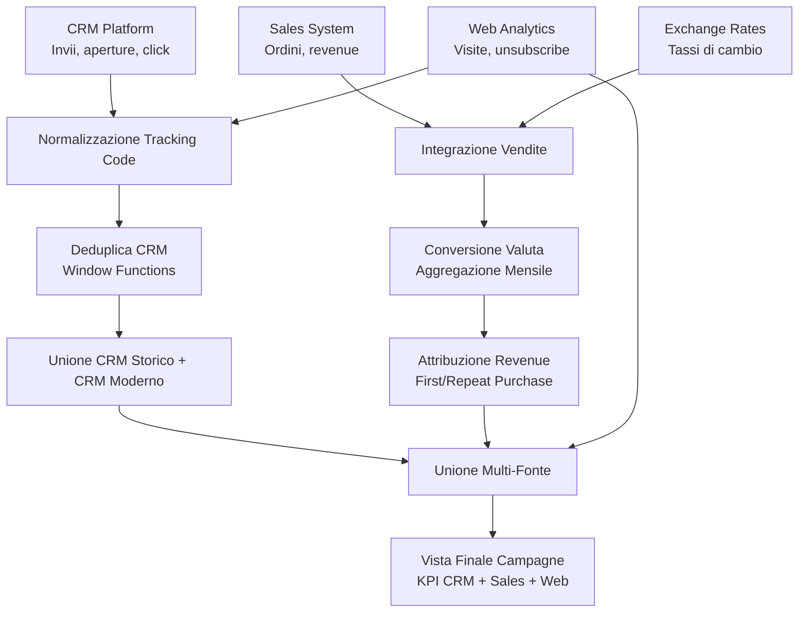

# 📊 Marketing Campaign Data Integration Pipeline (SQL)

Questa repository contiene una pipeline SQL avanzata progettata per integrare e normalizzare dati di campagne marketing provenienti da più fonti eterogenee.  
La pipeline unifica informazioni CRM, dati di vendita, tassi di cambio e metriche web, producendo una vista mensile completa delle performance di ogni campagna.

La logica è ispirata a un caso reale, ma **tutti i nomi, le tabelle e le strutture sono stati completamente anonimizzati** per garantire la totale privacy.

---

## 🎯 Obiettivo del progetto

L’obiettivo è creare una **vista unica e coerente** delle performance delle campagne marketing, integrando:

- dati CRM (invii, aperture, click)
- dati web (visite, unsubscribe)
- dati di vendita (ordini, revenue)
- tassi di cambio
- campagne ricorrenti e one‑shot
- deduplica tra sistemi diversi

Il risultato è una tabella finale pronta per:

- dashboard BI  
- analisi mensili  
- attribuzione revenue  
- confronto tra canali e paesi  
- reporting direzionale  

---

## 🧱 Architettura logica della pipeline

La pipeline integra quattro fonti principali:

| Fonte           | Descrizione             | Esempi KPI              |
|-----------------|-------------------------|--------------------------|
| CRM Platform    | invii, aperture, click  | delivered, opened, clicked |
| Web Analytics   | visite, unsubscribe     | visits, unsubscribe     |
| Sales System    | ordini e revenue        | orders, revenue         |
| Exchange Rates  | conversione valuta      | rate                    |

---

## 🔄 Diagramma della pipeline

## 🔄 Principali passaggi della pipeline
La logica SQL segue un flusso sequenziale suddiviso in **CTE** (Common Table Expressions):

1. **Normalizzazione dei Tracking Code**
- Rimozione caratteri speciali e uniformazione dei separatori (es. `|` vs `_`).
- Parsing delle URL per estrarre i parametri UTM puliti.

2. **Deduplica dei dati CRM**
- Utilizzo di `RANK()` per selezionare solo l'upload più recente per ogni campagna, eliminando duplicati tecnici.

3. **Integrazione Vendite & Valuta**
- **Join** tra ordini (SAP) e campagne tramite `order_id` o `reference`.
- Classificazione delle transazioni (*First Purchase* vs *Repeat*).
- Conversione dinamica della revenue applicando il tasso di cambio mensile corretto.

4. **Unione Multi-Fonte (The "Big Merge")**
- Unione dei flussi dati correnti con lo storico (*Legacy System*).
- Gestione delle attribuzioni differite (es. email inviata a giugno, acquisto a luglio).
- Recupero delle conversioni "No Cookies" non attribuite digitalmente.

5. **Logica di Priorità**
- Risoluzione dei conflitti tra fonti diverse per la stessa data/campagna, assegnando priorità alla fonte più affidabile per evitare doppi conteggi.

---

## 🧠 Tecniche SQL utilizzate
Questa query dimostra l'uso avanzato di **BigQuery SQL** per la data manipulation:

*   **Window Functions:** `RANK() OVER(PARTITION BY ...)` per la deduplica temporale.
*   **String Manipulation:** `REGEXP_REPLACE`, `SPLIT`, `STRPOS` e `SUBSTRING` per il parsing degli URL.
*   **Complex Joins:** `FULL`, `LEFT` e `RIGHT JOIN` combinati per gestire asimmetrie tra dati di vendita e dati di traffico.
*   **Conditional Logic:** `CASE WHEN` nidificati per la normalizzazione di Paesi e Brand.
*   **Date Handling:** Cast e formattazione date per allineare il reporting mensile (`YYYY-MM-01`).
*   **CTE (Common Table Expressions):** Struttura modulare per migliorare la leggibilità e la manutenzione del codice.

---

## 📈 Output finale
La query restituisce una tabella denormalizzata pronta per l'ingestione in strumenti di BI (**PowerBI** / **Tableau** / **Looker**), con la seguente granularità:

*   🗝️ **Chiavi:** Brand, Country, Date (Mese), Campaign Name.
*   🏷️ **Dimensioni:** Type (Email/SMS), Tracking Code, Delivery Label.
*   📥 **Metriche Funnel:** Delivered, Opened, Clicked, Unique Clicks.
*   💰 **Metriche Business:** Orders, Revenue (Local & Converted), Visits, Unsubscribes.
