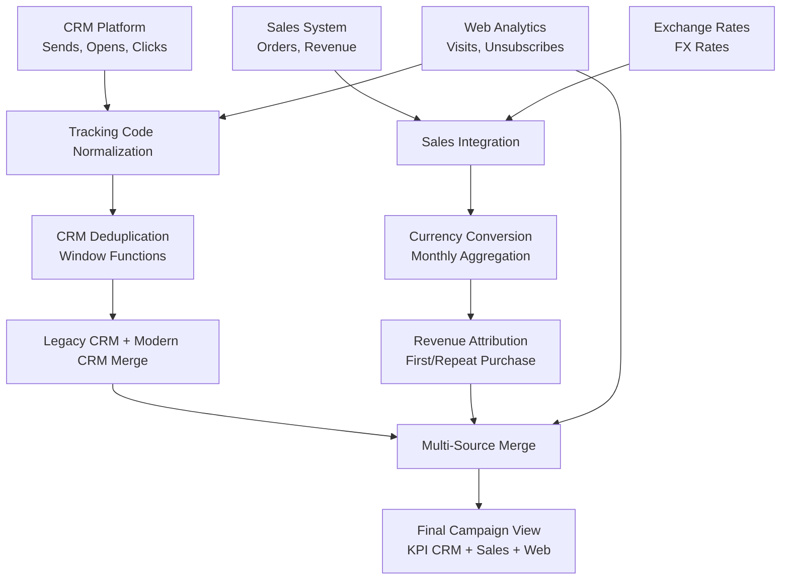

# 📊 Marketing Campaign Data Integration Pipeline (SQL)

This repository contains an advanced SQL pipeline designed to integrate and normalize marketing campaign data from multiple disparate sources. The pipeline unifies CRM information, sales data, exchange rates, and web metrics, producing a complete monthly view of each campaign's performance.

The logic is inspired by a real-world case study, but all names, tables, and structures have been completely anonymized to ensure strict confidentiality.

---

## 🎯 Project Objective

The goal is to create a single, coherent view of marketing campaign performance by integrating:

- CRM data (sends, opens, clicks)
- Web data (visits, unsubscribes)
- Sales data (orders, revenue)
- Exchange rates
- Recurring and one-shot campaigns
- Deduplication across different systems

The result is a final table ready for:

- BI dashboards
- Monthly analysis
- Revenue attribution
- Cross-channel and cross-country comparison
- Directional reporting

---

## 🧱 Logical Pipeline Architecture

The pipeline integrates four main data sources:

| Source          | Description             | Key KPI Examples           |
|-----------------|-------------------------|----------------------------|
| CRM Platform    | Sends, opens, clicks    | delivered, opened, clicked |
| Web Analytics   | visits, unsubscribe     | visits, unsubscribe        |
| Sales System    | Orders and revenue      | orders, revenue            |
| Exchange Rates  | Currency conversion     | rate                       |

---

## 🔄 Pipeline Diagram

## 🔄 Key Pipeline Steps
The SQL logic follows a sequential flow divided into CTEs (Common Table Expressions):

1. **Tracking Code Normalization**
- Removal of special characters and standardization of separators (e.g., | vs _).
- URL parsing to extract clean UTM parameters.

2. **CRM Data Deduplication**
- Utilization of RANK() to select only the most recent upload for each campaign, eliminating technical duplicates.

3. **Sales & Currency Integration**
- **Join** between orders (SAP) and campaigns via `order_id` or `reference`.
- Transaction classification (*First Purchase* vs *Repeat*).
- Dynamic revenue conversion applying the correct monthly exchange rate.

4. **Multi-Source Merge (The "Big Merge")**
- Merging current data flows with historical data (*Legacy System*).
- Handling deferred attribution (e.g., email sent in June, purchase in July).
- Recovery of "No Cookies" conversions not digitally attributed.

5. **Priority Logic**
- Resolving conflicts between different sources for the same date/campaign, assigning priority to the most reliable source to avoid double counting.

---

## 🧠 SQL Techniques Used
This query demonstrates advanced **BigQuery SQL** usage for data manipulation:

*   **Window Functions:** `RANK() OVER(PARTITION BY ...)` for temporal deduplication.
*   **String Manipulation:** `REGEXP_REPLACE`, `SPLIT`, `STRPOS`, and `SUBSTRING` for URL parsing.
*   **Complex Joins:** `FULL`, `LEFT`, and `RIGHT JOIN` combined to manage asymmetries between sales and traffic data.
*   **Conditional Logic:** Nested `CASE WHEN` for Country and Brand normalization.
*   **Date Handling:** Casting and date formatting to align monthly reporting (`YYYY-MM-01`).
*   **CTE (Common Table Expressions):** Modular structure to improve code readability and maintenance.

---

## 📈 Final Output
The query returns a denormalized table ready for ingestion into BI tools (**PowerBI** / **Tableau** / **Looker**), with the following granularity:

*   🗝️ **Keys:** Brand, Country, Date (Month), Campaign Name.
*   🏷️ **Dimensions:** Type (Email/SMS), Tracking Code, Delivery Label.
*   📥 **Funnel Metrics:** Delivered, Opened, Clicked, Unique Clicks.
*   💰 **Metriche Business:** Orders, Revenue (Local & Converted), Visits, Unsubscribes.

